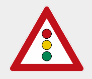

## Project: Traffic Sign Classification

Overview
---
In this project, I have used deep neural networks and convolutional neural networks to classify traffic signs. 

you will use what you've learned about deep neural networks and convolutional neural networks to classify traffic signs. 

To run this project, use the "Traffic_Sign_Classifier.ipynb" notebook.

Project Goals
---
* Dataset summary and visualization.
* Design, train and test a Lenet model architecture.
* Use the model to make predictions on new images & analyze the softmax probabilities of the new images.


### Dataset summary and visualization

Here is the statistics of the dataset. A 80-20% train-validation split is taken.

* Number of training examples   = 31367(80.0%)
* Number of validation examples = 7842(20.0%)
* Number of testing examples    = 12630
* Input Image data shape        = (32, 32, 3)
* Number of classes             = 43

Plotting the distribution, we can observe that both in training and validation set, the % of images per class is roughly the same.
<p align="center">
    
</p>

### Lenet architecture implementation 
#### Data augmentation
As a first step, images from the initial training, validation sets are resized using the given coordinate markers using the function below. NOTE: I have kept this step optional in this project.
```python
def resize(features,labels,coord,size):
```
Then a section of images (3%) per class are shifted in 4 different directions (up, down, left, right) by 3 pixels. NOTE: "Reflect" mode is used as padding during shift operation.
```python
def shift_augment(x,shiftval,y):
```
Finally a 80-20% (train-validation) split is obtained.

#### Preprocessing

As part of preprocessing, the images are subjected to the following operations

* RGB to Gray scale conversion (In this project, I have kept this step optional)
* Normalization

#### Lenet Architecture
<p align="center">
    
</p>

The architecture consists of 2 convolutional layers and 3 fully connected layers. Note the use flattening operation at the end of the 2nd convolutional layer.
A batch size of 128, total number of epochs = 10 & a learning rate of 0.001 are chosen.

* Layer 1: Convolutional. Input = 32x32x1. Output = 28x28x6.
    * Pooling. Input = 28x28x6. Output = 14x14x6.
* Layer 2: Convolutional. Input = 14x14x6.Output = 10x10x16.
    * Pooling. Input = 10x10x16. Output = 5x5x16.
    * Flatten. Input = 5x5x16. Output = 400.
* Layer 3: Fully Connected. Input = 400. Output = 120.
* Layer 4: Fully Connected. Input = 120. Output =  84.
* Layer 5: Fully Connected. Input =  84. Output =  43.


Running the preprocessed dataset with the above model yielded about 97.6% accuracy @ the 10th Epoch.
```python
EPOCH 10 ...
Validation Accuracy = 0.976
Model saved
```
#### Testing the training set with new images.

The following images are tested with the model.

<p align="center">
    Speed Limit 20 Km/h
    <p align="center">
    </p>
</p>
<p align="center">
    Ahead Only
    <p align="center">
    </p>
</p>
<p align="center">
    Bumpy road
    <p align="center">
    </p>
</p>
<p align="center">
    Roadwork 
    <p align="center">
    </p>
</p>
<p align="center">
    Traffic signals 
    <p align="center">
    </p>
</p>   

#### Test accuracy

| Speed Limit (20 Km/h) | Speed limit (30km/h) | End of all speed and passing limits| End of speed limit (80km/h)| Right-of-way at the next intersection |
|--|--|--|--|--|
|90.40|4.26|2.61|2.12|0.304|


